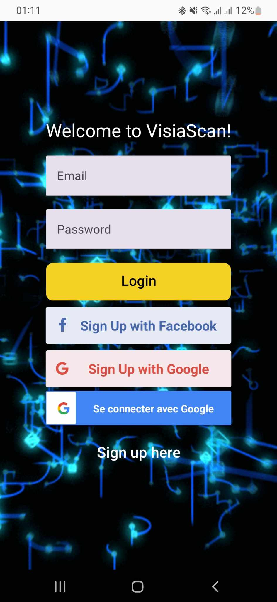
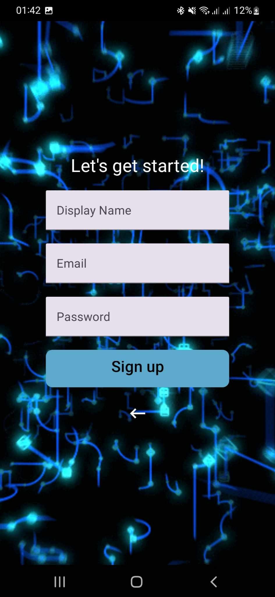
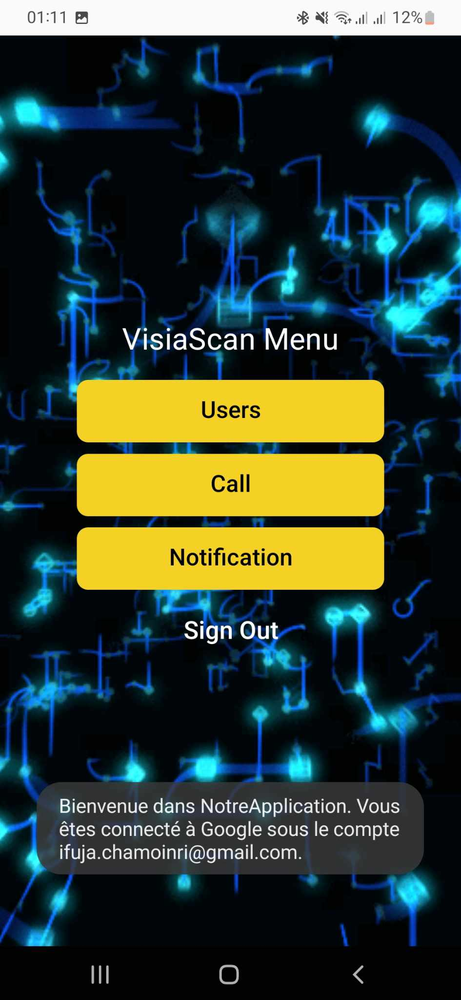

# L'application VisIAscan

Gestion d'accès distante via reconnaissance faciale.

## Description

Une application mobile Android développé avec le framework React Native, permettant aux résidents d'autoriser ou refuser l'accès à distance à leur bâtiment via reconnaissance faciale. Connectée à un interphone et au serveur Firebase, elle offre une expérience sécurisée et pratique pour gérer les entrées et contrôler les personnes autorisées.
Le langage de programmation utilisé est JavaScript.

## Captures d'écran

    
    
    

## Prérequis

Avant d'installer et d'exécuter cette application, assurez-vous d'avoir les éléments suivants :
- Node.js et npm : Assurez-vous d'avoir Node.js (v18.13.0) et npm (9.3.1) installés sur votre système. Node.js et npm sont nécessaires pour exécuter le code JavaScript de l'application.

- Expo CLI : Vous devez avoir Expo CLI installé globalement sur votre système. Expo CLI est utilisé pour lancer le serveur de développement et exécuter l'application sur un émulateur ou un appareil physique.

- Compte Expo : Créez un compte Expo si vous n'en avez pas déjà un. Un compte Expo est nécessaire pour gérer vos projets, accéder aux fonctionnalités d'Expo et exécuter l'application sur des appareils physiques.

- Compte Firebase : Créez un compte Firebase en ajoutant également une application Android.

- Appareil Android ou Émulateur : Vous aurez besoin d'un appareil Android ou d'un émulateur Android configuré pour tester et exécuter l'application.

## Installation

1. Ouvrez un terminal et clonez le référentiel : "git clone https://github.com/Ifuja/ProjetVisiAScan.git".
2. Accéder au répertoire de l'application "cd nom-de-lapplication"
3. Exécuter l'application : "npx expo start"
Cela lancera le serveur de développement Expo. Vous pouvez maintenant scanner le QR code avec l'application Expo Go sur votre téléphone ou utiliser un émulateur pour voir l'application en marche.

## Configuration

Pour que l'application fonctionne correctement, vous devez configurer les clés d'API nécessaires. Actuellement, notre application est connectée au serveur Firebase pour gérer les appels d'interphone et les autorisations d'entrée. Pour configurer les clés d'API Firebase, suivez ces étapes :
1. Créer un compte Firebase (si vous n'en avez pas déjà un) et créez un projet Firebase.
2. Dans le tableau de bord de votre projet Firebase, accédez aux paramètres du projet et recherchez la section "Clés de l'API".
3. Générez une nouvelle clé API pour le service Firebase Realtime Database et pour le service Firebase Authentication.
4. Copiez les clés générées et ajoutez-les au fichier de configuration de l'application, situé dans le dossier config à la racine du projet (chemin vers le fichier dans notre projet : src/firebase/index.js)
